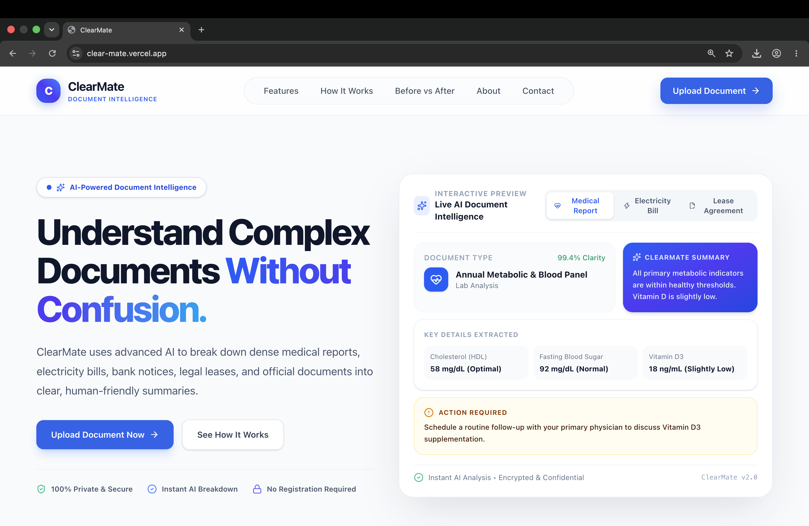
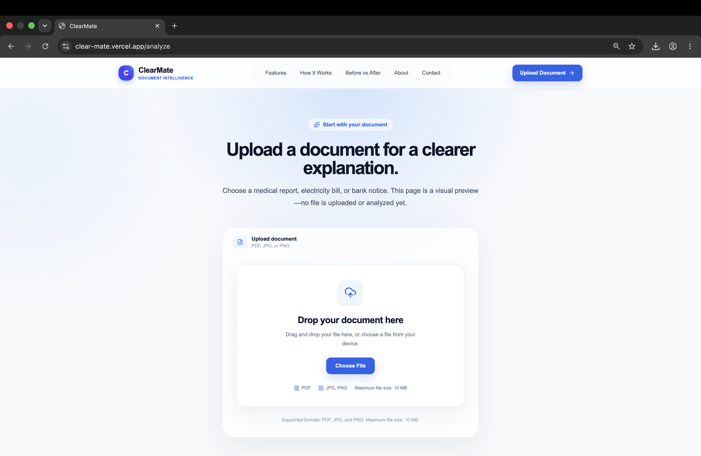
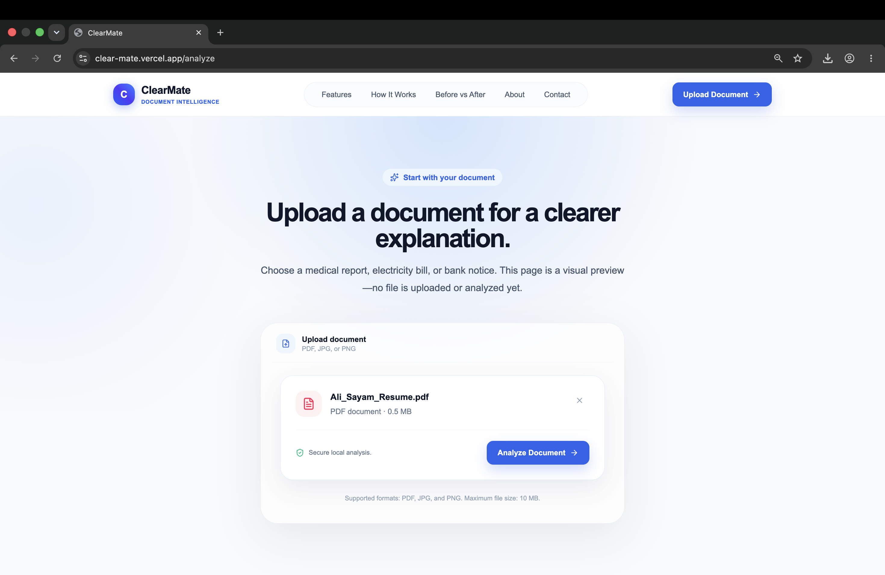
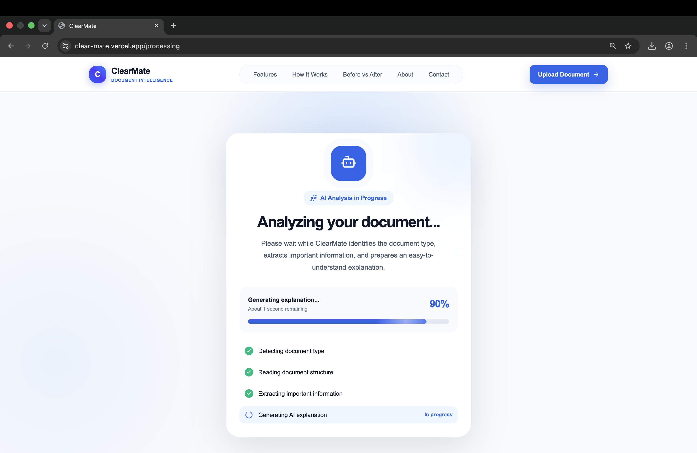
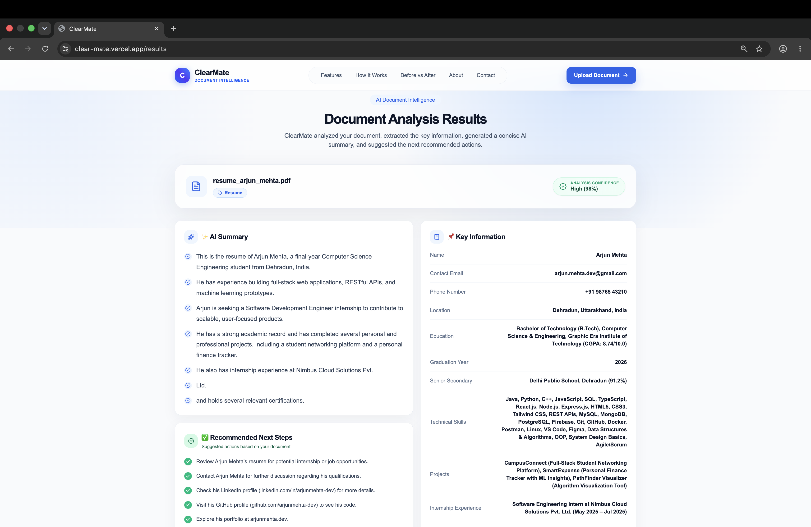
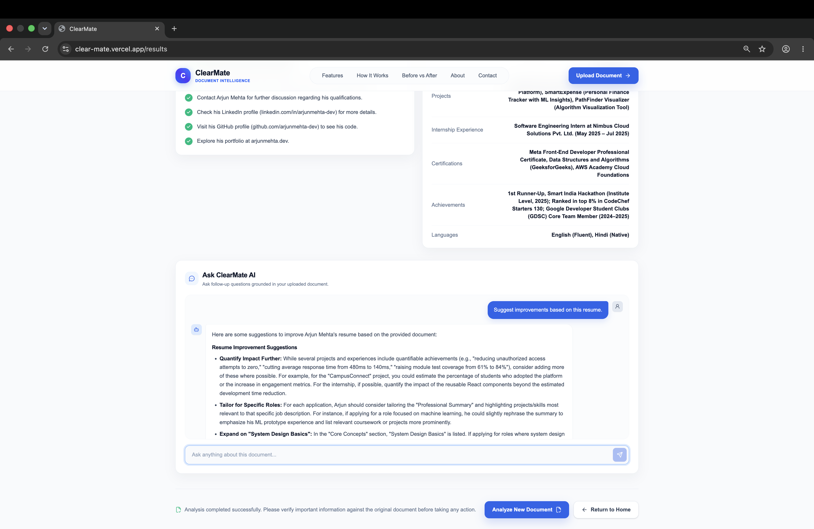
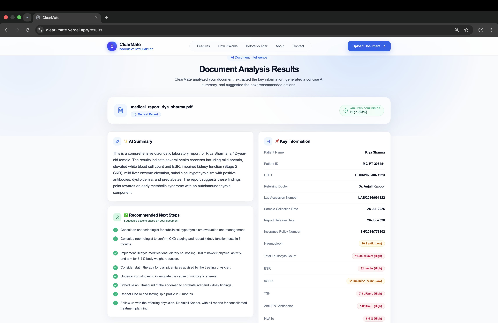
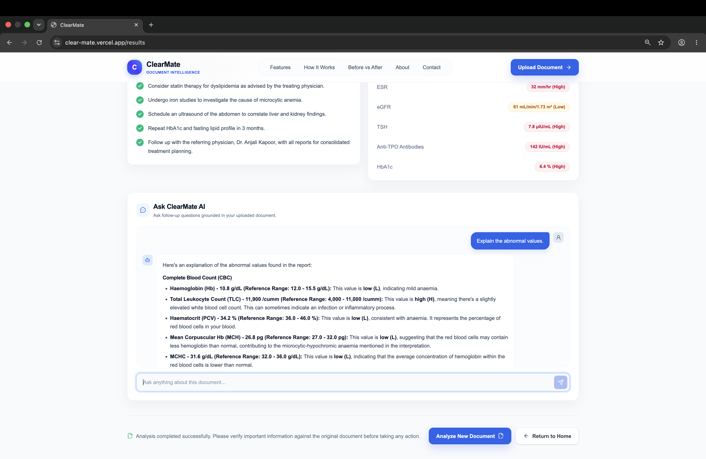
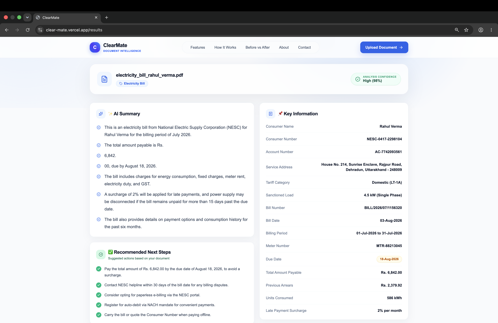
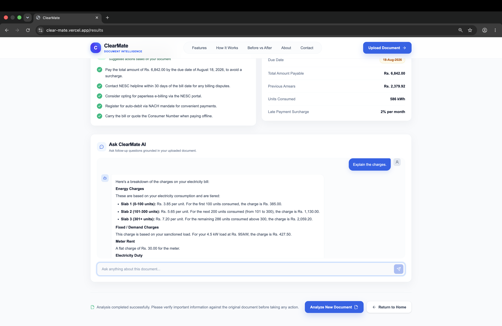

# 🚀 ClearMate – AI-Powered Document Intelligence

<p align="center">
  <strong>Transform Complex Documents into Clear, Actionable Insights.</strong>
</p>

ClearMate is an AI-powered document intelligence platform that enables users to quickly understand complex PDF documents. It automatically generates concise summaries, extracts important information, recommends actionable next steps, and provides an interactive AI assistant for asking document-specific questions.

Built for the **OpenAI Codex Hackathon 2026**.

---

# 🌐 Live Demo

🔗 **https://clear-mate.vercel.app**

---

# ✨ Features

- 📄 Upload and analyze PDF documents
- 🤖 AI-powered document understanding
- 📝 Automatic document summaries
- 🔑 Intelligent key information extraction
- 💬 Interactive AI Chat for document-specific questions
- ✅ Personalized recommendations and next steps
- ⚡ Fast and responsive user experience
- 📱 Clean and modern interface

---

# 📂 Supported Documents

ClearMate currently supports:

- 📄 Resume / CV
- 🏥 Medical Reports
- ⚡ Electricity Bills
- 📑 Lease Agreements

The architecture is designed to support additional document types in the future.

---

# 🛠 Tech Stack

## Frontend

- Next.js 16
- React
- TypeScript
- Tailwind CSS

## Backend & AI

- Next.js API Routes
- OpenRouter API
- Google Gemini 2.5 Flash Lite (via OpenRouter)

## Deployment

- Vercel

---

# 🤖 AI Capabilities

ClearMate intelligently:

- Identifies the document type
- Generates easy-to-understand summaries
- Extracts important information
- Highlights critical details
- Suggests actionable recommendations
- Answers follow-up questions using contextual AI chat

---

# 🔄 Workflow

1. Upload a supported PDF document.
2. ClearMate extracts the document text.
3. AI identifies the document type.
4. A concise summary is generated.
5. Important information is extracted automatically.
6. Personalized recommendations are displayed.
7. Users can ask follow-up questions through the integrated AI assistant.

---

# 📸 Screenshots

## 🏠 Landing Page



---

## 📤 Upload Document



---

## 📁 File Selected



---

## ⚙️ AI Processing



---

## 📄 Resume Analysis



---

## 💬 Resume AI Chat



---

## 🏥 Medical Report Analysis



---

## 💬 Medical Report AI Chat



---

## ⚡ Electricity Bill Analysis



---

## 💬 Electricity Bill AI Chat



---

# 🚀 Getting Started

Clone the repository

```bash
git clone https://github.com/alisayam-786/ClearMate.git
```

Install dependencies

```bash
pnpm install
```

Create a `.env.local` file

```env
OPENROUTER_API_KEY=your_api_key_here
```

Start the development server

```bash
pnpm dev
```

Open your browser and visit

```
http://localhost:3000
```

---

# 📁 Project Structure

```
app/
components/
contexts/
hooks/
lib/
public/
types/
client/
```

---

# 💡 Future Improvements

- OCR support for scanned PDF documents
- Multi-language document understanding
- Image-based document analysis
- Voice-enabled AI assistant
- Export AI summaries as PDF
- Side-by-side document comparison
- Secure document history
- Mobile application

---

# 👨‍💻 Developed By

**Ali Sayam**

B.Tech Computer Science Engineering

Sharda University

---

# 🏆 Hackathon

Built for the **OpenAI Codex Hackathon 2026**.

ClearMate demonstrates how AI can transform complex documents into simple, understandable, and actionable insights, making important information accessible to everyone.

---

# 📄 License

This project was created for the **OpenAI Codex Hackathon 2026** and is shared for educational and demonstration purposes.
